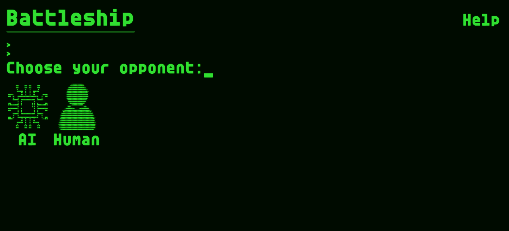
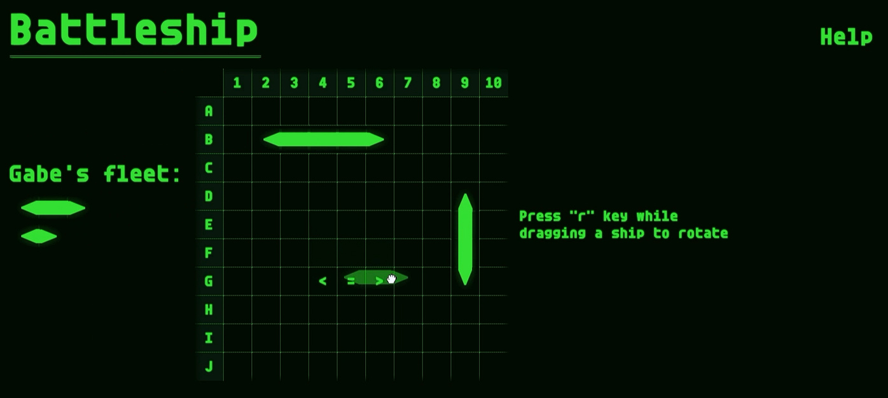
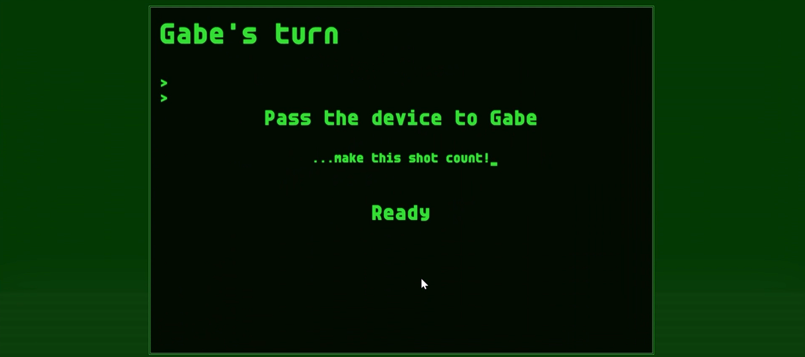
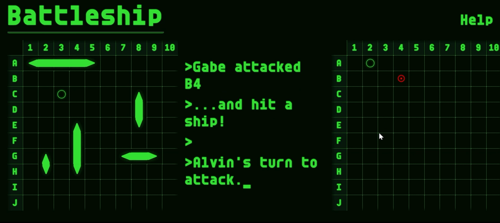
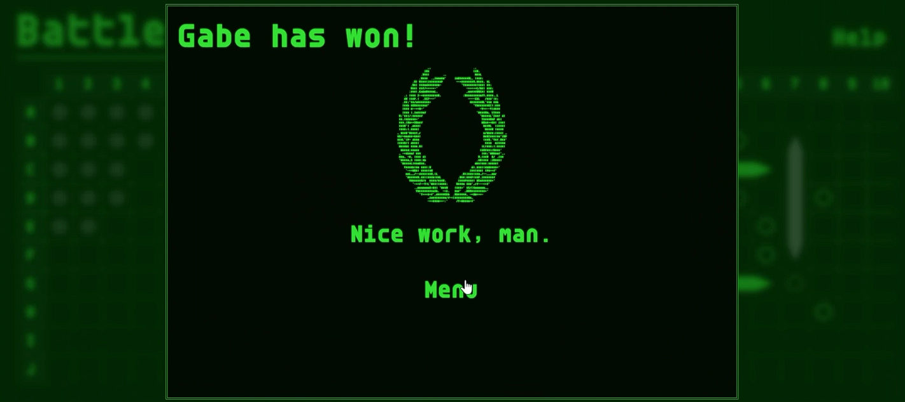

# :boom: Battleship :anchor:

    

## Table of Contents

-   [About](#about)
-   [Installation / Website Demo](#installation--website-demo)
-   [Features](#features)
    -   [PvP Mode](#pvp-mode)
    -   [AI Mode](#ai-mode)
    -   [Drag-and-Drop Placement](#drag-and-drop-placement)
    -   [Responsive Terminal UI](#responsive-terminal-ui)
-   [Tech Stack](#tech-stack)
-   [Gallery](#gallery)
-   [Credit](#credit)

## About

This Battleship project is the most detailed project of 2025 that I've created outside of an academic setting via a tech stack of HTML5/SCSS/TypeScript. The site provides a fresh reimagination of the classic Battleship game, providing accessibility to both desktop and mobile users, and allowing for both PvP, and AI combat. Built with modular TypeScript classes to comprise the ships, board, players, and renderer, and rigorously tested with the Jest library, the project demonstrates exceptional attention to detail while showcasing thorough unit-testing practices.

## Installation / Website Demo

The website is hosted on GitHub pages, and can be accessed below:

[Battleship](https://gaberashko.github.io/battleship/)

Otherwise, the project's functionality can be tested through the following steps:

1. Download the repository.
2. Extract the repository.
3. Open the folder in VSCode, and run `npm install`.
4. Then, run `npx webpack serve`.
5. Locate the `http://localhost:8080/` output in the terminal.
6. Hold <kbd>Ctrl</kbd> and click on `http://localhost:8080/`, and the hosted deployment version will open.

## Features

This Battleship experience includes several polished features to make combat and ship placement engaging and elegant. Several days were put into creating little design details to accentuate the terminal theme of the website! Pulsating board lights, text-based ship preview rendering, a reusable modal-component developed from scratch with fluid animation, and modified sound effects during combat keep the experience wholly immersive!

### PvP Mode

The game supports local pass-and-play combat! Two people in proximity can take turns setting up their respective board, and launching an attack on the other! Transition between turns is seamless, as the board's obfuscation allows the game to be passed along without revealing ship positions to the opponent.

### AI Mode

The game also supports a player-vs-AI combat system. One person can set up their board, and select an AI difficulty (e.g. easy, medium, hard) to battle against. The AI is equipped with three difficulties that alter its guessing strategy, and utilization of game history/an internal memory system to determine the next best attack. The AI will generate a random board setup, and can place ships both horizontally and vertically.

### Drag-and-Drop Placement

This Battleship experience allows players to set up their board with stylish, responsive drag-and-drop placement. Players can select a ship off of the ship container, and drag it to the spot they wish to place it. The board provides continuous placement preview feedback indicating whether or not the ship can be placed in the current position. Players may adjust ship rotation by pressing the `r` key while dragging the ship. Ships may be picked up off of the board and moved to a new spot after initial placement.

### Responsive Terminal UI

The site touts a retro computer-terminal aesthetic reminiscent of older DOS machines. The site was developed with reusable, scalable, responsive web-components created from scratch with HTML and SCSS. The site's layout can handle both desktop screens and mobile devices, and adjusts fluidly to changes in window sizing.

## Tech Stack

-   🛠️ **HTML5** - Used for fundamental web architecture.
-   ⚙️ **TypeScript** - Used for modular Ship, Player, Board, GameController, and GameRenderer classes.
-   🎨 **SCSS** - Used to develop modular CSS rules to easily maintain site aesthetic.
-   🧱 **Webpack** - For module bundling and asset management.
-   💾 **sessionStorage API** - Used to handle and store persistent game and board data used by the Player, GameController, and GameRenderer classes.
-   🚩 **Jest** - Unit testing of modular components.

## Credit

Sound effects used in Battleship were provided from the royalty-free sound effect archive of [Pixabay](https://pixabay.com/), and modified with [Audacity](https://www.audacityteam.org). Modified SVGs for the crosshair, attack, and ship icons were provided by [SVGRepo](https://www.svgrepo.com).

### Enjoy! :white_check_mark:

[Back to Top](#table-of-contents)
